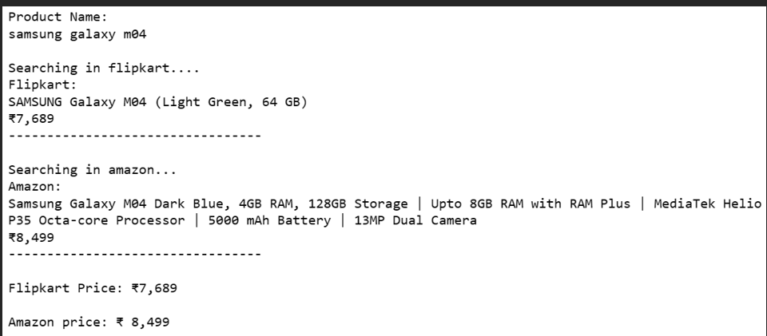
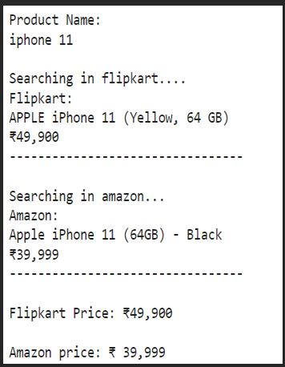
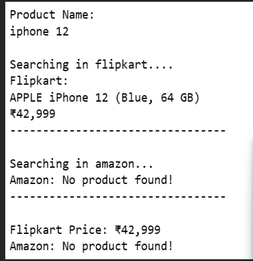

# PriceComparisionTool
Amazon Vs Flipkart price comparision tool

# ABSTRACT
The Amazon vs. Flipkart Price Comparison Tool is a concise Python project focused on comparing product prices between two major e-commerce platforms: Amazon and Flipkart. Employing web scraping techniques via BeautifulSoup, users input a specific product, and the tool retrieves and contrasts prices from both Amazon and Flipkart. The streamlined functionality ensures a straightforward comparison, aiding users in making informed purchasing decisions. The tool offers a simple interface, emphasizing ease of use and quick access to real-time pricing information. It serves as a targeted solution for consumers seeking efficient comparisons between these prominent online retailers.

# Objective
The primary goal of the Price Comparison Tool is to empower consumers with a streamlined and efficient means of comparing product prices between the two leading e-commerce platforms—Amazon and Flipkart. Leveraging web scraping techniques, the project provides users with real-time pricing information for a specified product, facilitating informed purchasing decisions. The tool's simplicity and user-friendly interface prioritize quick access to comparative data, ensuring ease of use. By focusing on the specific comparison between Amazon and Flipkart, the project aims to enhance transparency and convenience in the online shopping experience for users seeking the best deals across these major platforms. 

# Conclusion:

In conclusion, the Amazon vs. Flipkart Price Comparison Tool streamlines the process of comparing product prices across two major e-commerce platforms. Its user-friendly interface, real-time data retrieval, and error handling contribute to an efficient and reliable experience. The tool's flexibility allows users to customize comparisons, and its adherence to legal and ethical considerations promotes responsible use. While currently focused on Amazon and Flipkart, potential enhancements could include features like historical price tracking or user notifications. Overall, this project empowers consumers with timely information, fostering informed decision-making in the dynamic landscape of online shopping.

# OUTPUT IMAGES

